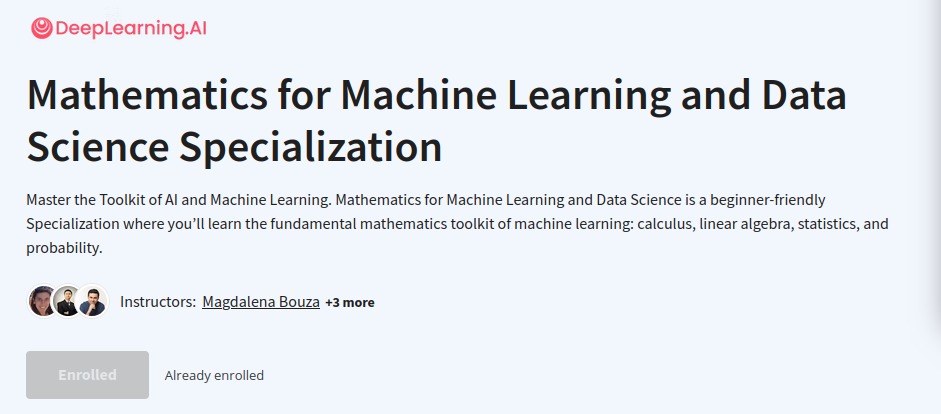

# Mathematics for Machine Learning and Data Science Specialization - Coursera

The Specialization is divided into 3 courses. Each course has additional lab assignments and quizzes for practicing the concepts taught in the video lectures. This repository contains the notes and solved assignments (python notebooks) to help students who are stuck and find no hint.

### Course 1: Linear Algebra for Machine Learning and Data Science
---

- <a href="Linear Algebra for Machine Learning and Data Science/Week1/">Week 1<a>
- <a href="Linear Algebra for Machine Learning and Data Science/Week2/">Week 2<a>
- <a href="Linear Algebra for Machine Learning and Data Science/Week3/">Week 3<a>
- <a href="Linear Algebra for Machine Learning and Data Science/Week3/">Week 4<a>

### Course 2: Calculus for Machine Learning and Data Science
---

- <a href="Calculus for Machine Learning and Data Science/Week1/">Week 1<a>
- <a href="Calculus for Machine Learning and Data Science/Week2/">Week 2<a>
- <a href="Calculus for Machine Learning and Data Science/Week3/">Week 3<a>

### Course 3: Probability & Statistics for Machine Learning & Data Science
---

- <a href="Probability & Statistics for Machine Learning & Data Science/Week1/">Week 1<a>
- <a href="Probability & Statistics for Machine Learning & Data Science/Week2/">Week 2<a>
- <a href="Probability & Statistics for Machine Learning & Data Science/Week3/">Week 3<a>
- <a href="Probability & Statistics for Machine Learning & Data Science/Week4/">Week 4<a>
---

### [Specialization Certificate](https://coursera.org/share/56c69495273b783c472987d0add21151)